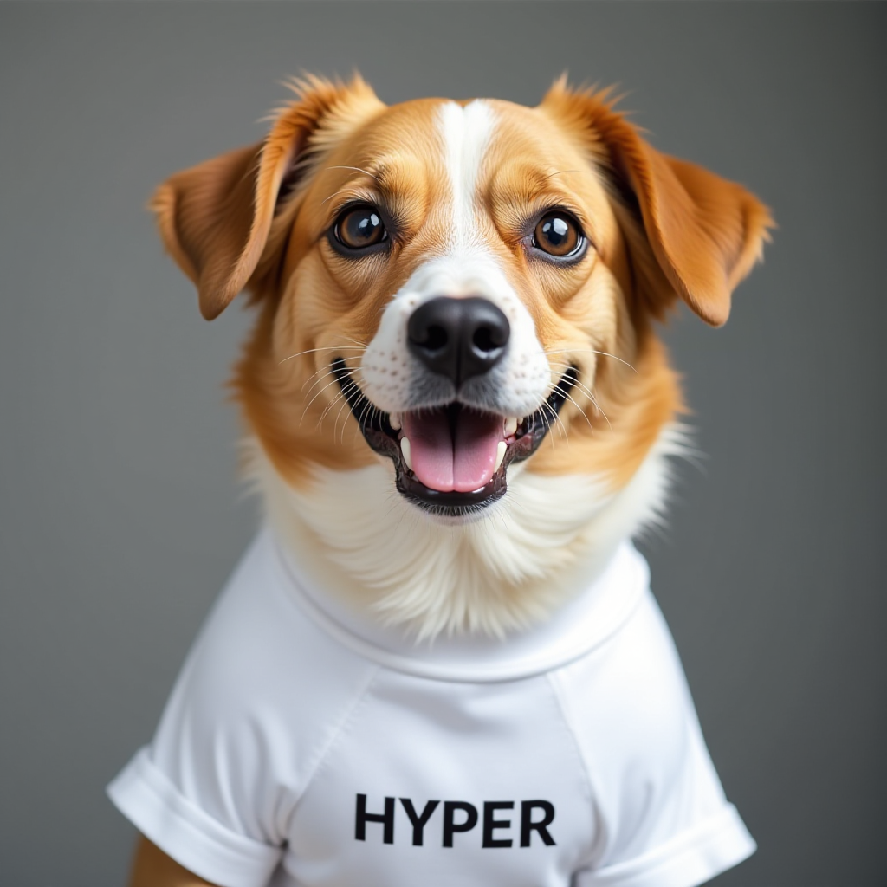

# ByteDance/Hyper-SD FLUX.1-dev 8-step Cog Model

This is an implementation of [ByteDance/Hyper-SD FLUX.1-dev 8-step](https://huggingface.co/ByteDance/Hyper-SD) as a [Cog](https://github.com/replicate/cog) model.

## Development

Follow the [model pushing guide](https://replicate.com/docs/guides/push-a-model) to push your own model to [Replicate](https://replicate.com).

## How to use

Make sure you have [cog](https://github.com/replicate/cog) installed.

To run a prediction:

    cog predict -i prompt="a dog smiling and looking directly at the camera, wearing a white t-shirt with the word 'HYPER' printed on it."

